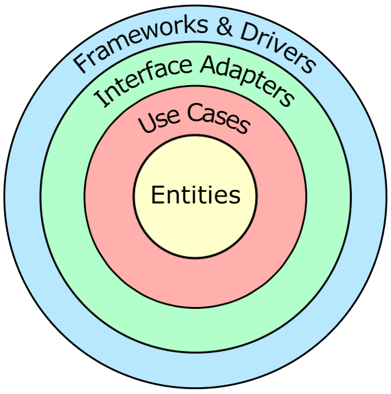

# codex
A suite of world building tools for writers or dungeon masters.

# Intro
Demonstrates knowledge of:
- [Clean Architecture](https://blog.cleancoder.com/uncle-bob/2012/08/13/the-clean-architecture.html)
- [Gatsby](https://www.gatsbyjs.com/)
- Gradle
- [Java TestContainers](https://java.testcontainers.org/)
- JUnit 5
- Kotlin
- [Material UI](https://mui.com/)
- MongoDB
- [Postman](https://www.postman.com/product/what-is-postman/)
- React
- Spring Boot
- TypeScript

# Getting Started
- Follow the README under `/codex-dev-tools`
- Start the Codex Backend:
  - Run `/codex-api/io.guy.home.codex.api.CodexApplication.kt`
  - Visit [http://localhost:8080/health](http://localhost:8080/health) to validate.
- Start the Codex Frontend:
  - Follow the README under `/codex-ui`

# Architecture
Codex's architecture is based off of Robert Martin's [Clean Architecture](https://blog.cleancoder.com/uncle-bob/2012/08/13/the-clean-architecture.html).

Clean Architecture is a layered architecture that emphasizes a separation of concerns and produces software systems that are:
- Independent of frameworks such as Spring Boot
- Testable at each individual layer (web, data, business rules, etc.)
- Independent of any specific user interface, database provider, etc.

Clean Architecture enforces one overriding rule, the Dependency Rule, that says that source code dependencies can only point inwards. Referencing the diagram above, nothing in an inner circle may know anything about anything in an outer circle.

Codex implements Clean Architecture by adhering to the following architectural decisions:
- ADR-1: Separate source code into layers following the Dependency Rule:
  - `codex-api` (outermost) - RESTful APIs and Spring Boot Framework Configuration
  - `codex-data` - Database Adapters
  - `codex-domain` (innermost) - Business Logic and Entities

- ADR-2: Limit framework dependencies by avoiding "Spring Magic" and auto-generated code
  - Wire dependencies into Spring's IOC Container at the edge (see `/codex-api/io.guy.home.codex.api.common.di.spring.SpringDependencyFactory.kt`)
  - Hard-code database queries instead of relying on `spring-data`'s subject / predicate keywords for auto-generating JPQL methods
  - These decisions and more allow us to easily swap frameworks with minimal rework

- ADR-3: Write small, efficient tests at each layer
  - Limit unit tests to `codex-domain` to thoroughly test business logic
  - Write integration tests in `codex-api` and `codex-data` using technologies like Docker and Java TestContainers to simulate real integrations running the same versions used in production 

# Postman Collection
Download [Postman](https://www.postman.com/downloads/) and import `/postman/codex-api.postman_collection.json`.